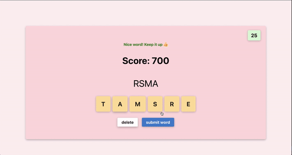

# Anthony's Anagrams 

I created a game where the user creates as many words as possible in 60 secs. I used React with TypeScript, along with react-jss for styles and Firebase for storing game data.

## DEMO



## Getting Started

### `npm start`

Runs the app in the development mode.<br>
Open [http://localhost:3000](http://localhost:3000) to view it in the browser.

The page will reload if you make edits.<br>
You will also see any lint errors in the console.

### Prerequisites

What things you need to install the software and how to install them

```
TODO: Explain how to set up Firebase to grab anagram word data
```

## Built With

* React with TypeScript
* react-jss for styling


## Authors

* **Anthony Dike** - [antdke](https://github.com/antdke)

## License

This project is licensed under the MIT License - see the [LICENSE.md](LICENSE.md) file for details
